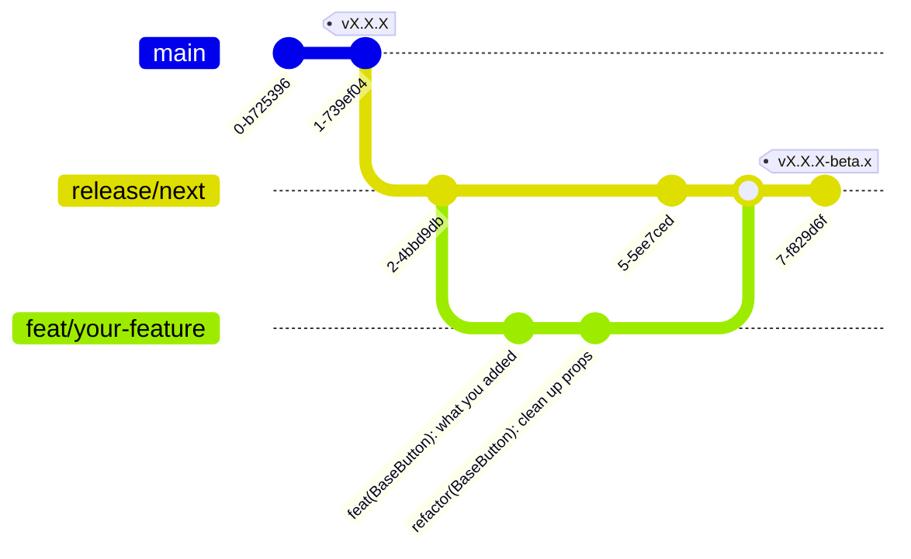

# Contributing to Shuriken UI - Tailwind

Thanks for taking the time to contribute! 🎉

In this guide you will find all the information you need to contribute to the project.

## What is Shuriken UI Tailwind?

Shuriken UI Tailwind is main part of the Shuriken UI project by [Css Ninja](https://github.com/cssninjaStudio). It goal is to provide a set of Tailwind CSS components, to be framework agnostic and highly customizable.

## New contributor guide

This package provide a [Tailwind CSS preset](https://tailwindcss.com/docs/presets) which contains all the components and utilities. It also extend the default theme with some colors and fonts.

All the components are separated in their own [Tailwind CSS plugin](https://tailwindcss.com/docs/plugins) and can be configured in the `tailwind.config.ts` file, so you can easily customize each component.

If you find a bug or want to add new features, makes sure to check if it has an impact on Shuriken UI Nuxt. If it does, make sure to submit a PR to all the projects.

Also, note that we use `release/next` branch to develop new features. If you want to contribute, make sure to create a new branch from `release/next` and to submit your pull request to `release/next` branch. (see [Git conventions](#git-conventions))

If you have any doubt or questions, feel free to [open a discussion](https://github.com/shuriken-ui/tailwind/discussions).

## Setup the project

We haven't published the test project yet. For now, you can follow the steps described in the [Shuriken UI Nuxt](https://github.com/shuriken-ui/nuxt/blob/main/CONTRIBUTING.md#setup-the-project) project to tests your changes in the playground.

## Submitting your changes

Once you are done with your changes, you can submit a pull request, also known as a PR.

- Make sure the tests pass locally by running `pnpm test`, this will run the linter.
- Make sure to create a draft PR if it's not ready to be merged, see [how to change stage of a PR](https://docs.github.com/en/pull-requests/collaborating-with-pull-requests/proposing-changes-to-your-work-with-pull-requests/changing-the-stage-of-a-pull-request)
- Make sure to add a description of your changes, if relevant, add screenshots or gifs to illustrate your changes.
- Don't forget to [link PR to issue](https://docs.github.com/en/issues/tracking-your-work-with-issues/linking-a-pull-request-to-an-issue) if you are solving one.
- Enable the checkbox to [allow maintainer edits](https://docs.github.com/en/github/collaborating-with-issues-and-pull-requests/allowing-changes-to-a-pull-request-branch-created-from-a-fork) so the branch can be updated for a merge. Once you submit your PR, a Shuriken UI maintainer will review your proposal. We may ask questions or request additional information.
- We may ask for changes to be made before a PR can be merged, either using [suggested changes](https://docs.github.com/en/pull-requests/collaborating-with-pull-requests/reviewing-changes-in-pull-requests/incorporating-feedback-in-your-pull-request) or pull request comments. You can apply suggested changes directly through the UI. You can make any other changes in your fork, then commit them to your branch.

## Git conventions

We use [conventional commits](https://www.conventionalcommits.org/en/v1.0.0/) to make our commits more readable and to generate our changelog.

Make sure to prefix your commit with one of the following types:
`fix:`, `feat:`, `build:`, `chore:`, `ci:`, `docs:`, `style:`, `refactor:`, `perf:`, `test:`

Use the imperative, present tense: “change” _not “changed” nor “changes”_.

